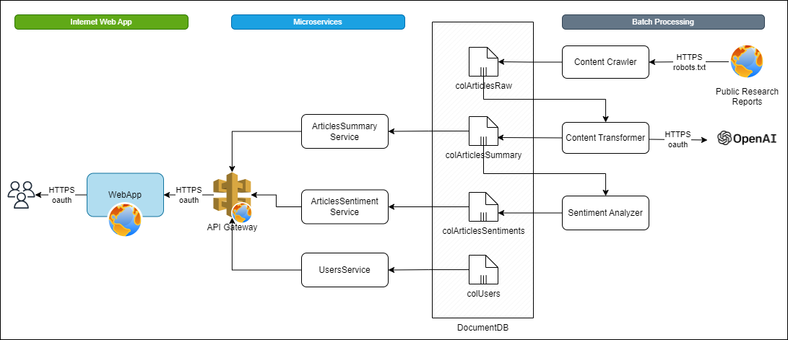

# Architecture Design Document

## Executive Summary

Broker/Dealers, both large & small, publish research reports providing their perspective on markets & economies. The reports are long, verbatim and requires considerable amount of time sifting through. 

Recently, the Artificial (AI) Intelligence Models like GPT (Gerenerative Pre-Trained Transformer) made giant leaps in helping summarize long documents, albeit not 100% accurate. 

Objective 1: Leverage the GPT model to summerize large reserach reports into few condensed and concise paragraphs on page for easy reading. 

Objective 2: For each summary produced extract the sentiment by performing sentiment analysis on the summaries

## Functional Requirements

==Phase 1==

- Develop a web application accesible on internet displaying summary of research reports published by various broker/dealer houses
- The research reports should be sourced from public sources like websites of the broker/dealers
- The web application should contain one landing page which shows one paragraph per research house with attributions & links to the original article

==Phase 2==
- Enable registration for the users using the web app
- Enable SSO by integrating with large providers

==Phase 3==
- Perform sentiment analysis on the summary extracted from the phase 1.
- The sentiments should be amongst Positive, Negative, Neutral categories

==Phase 4==
- Create a new section, "What it means for me?"
- Requirements TBD

## Non Functional Requirements
- The app is expected to have 100 concurrent users and 1000 annual users with annual growth rate of 10%

- Given the app would on internet, the concurrent & peak usage could not be satisfactorily estimate. As baseline use following. 

- The app would need a database with no particular need for transactions. Also the the schema will be even evolving so a document based db should be good enough.
- Azure DevOps should be used with GIT as tool for SCM.

## Architecture Diagram

